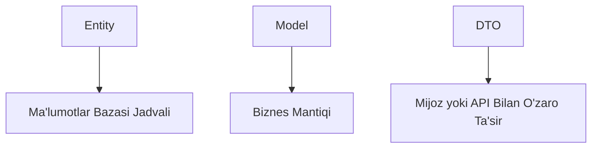

# DTO, Model va Entity

 
 

### Nega bir obyekt o'rniga uchta kerak? 🤔

Tasdavvur qiling, siz bir xonadonda yashab, o'sha joyda ishlaysiz va mehmonlarni ham shu yerda qabul qilasiz. Tabiiyki, tartib bir oz buziladi, to'g'rimi? 🎉 **Entity**, **Model** va **DTO**larni ajratmaslik ham shunga o'xshaydi. Ularni birga ishlatsangiz, kod ham chalkashadi, ham o'qish qiyin bo'lib qoladi.

Har biri o'z vazifasini bajarsa, kodni tushunish osonroq bo'ladi va har bir qatlam (API, biznes logika, ma'lumotlar bazasi) o'ziga xos mantiqda ishlaydi. 🎯

---
 

### Ular o'zi nima? 🤷‍♂️

| Term     | Definition                                                                                              |
|----------|---------------------------------------------------------------------------------------------------------|
| **DTO**  | Ma'lumotlarni uzatish obyekti (DTO) — bu ilovaning qatlamlari o'rtasida ma'lumotlarni uzatish uchun ishlatiladigan yengil ob'ekt. |
| **Model**| Ilovangiz ichida ishlatiladigan ma'lumotlar tuzilmasini ifodalaydi, ko'pincha biznes mantiqiga yaqin.      |
| **Entity**| Sizning saqlash qatlamingizdagi ma'lumotlar bazasi jadval tuzilmasini ifodalaydi, odatda EF Core kabi ORM bilan bog'liq. |

#### Asosiy Farqlar

- **Entity**lar ma'lumotlar bazasi bilan o'zaro ta'sir qilish uchun ishlatiladi va jadvallardagi qatorlarni ifodalaydi.
- **Model**lar ilovangiz ichida ma'lumotlarni qanday qayta ishlashini belgilaydi.
- **DTO**lar qatlamlar o'rtasida yoki tashqi mijozlarga to'g'ri ma'lumotlarni uzatishga e'tibor qaratadi.

---
 

### Entity nima? 📦

**Entity** — bu sizning ma'lumotlar bazasidagi jadvalning aksidir. Ya'ni, har bir qatorni obyekt ko'rinishida tasvirlaydi.

[!code-csharp]

> [!NOTE]
> Entity bilan bevosita API yoki biznes qatlamida ishlash tavsiya etilmaydi. Chunki bu xavfsizlik va moslashuvchanlikni kamaytiradi.

---
 

### Model nima? 🛠️

**Model** — bu biznes logikaga mos keladigan ma'lumotni tasvirlash uchun ishlatiladi. Ko'pincha validatsiya yoki ma'lumotni qayta ishlash uchun kerak bo'ladi.

[!code-csharp]

> [!TIP]
> Model — bu qahvaxona ichidagi menyu: tashqi mijozlar uni ko'rmaydi, lekin u asosiy faoliyatni boshqaradi. ☕

---
 

### DTO nima? 🚚

**DTO** (Data Transfer Object) — bu ma'lumotni tashqi dunyoga (API mijozlariga) jo'natish uchun eng qulay shaklga keltirilgan obyekt.

[!code-csharp]

> [!NOTE]
> DTO ma'lumotni minimal miqdorda va xavfsiz shaklda yetkazish uchun ishlatiladi. Ya'ni, "bu yerda faqat kerakli narsani oling" tamoyiliga asoslanadi. 🛡️

---
 

### Mapperlar va ularning ahamiyati ✨

Mapperlar — bu ma'lumotni bir obyekt turidan ikkinchisiga avtomatik ravishda o'zgartiruvchi sehrli vosita. 🎩🐇 

Tasavvur qiling, qo'lda har bir `Entity`ni `DTO`ga aylantirasiz: bu **matematika muammosi**day gap! Mapperlar esa buni avtomatlashtirib, hayotingizni yengillashtiradi.

#### AutoMapper misoli

[!code-csharp]

> [!TIP]
> Mapperlar ishlashda vaqtni tejaydi va kamroq xato qilishga yordam beradi. 🔧⏳

---
 

### Hammasi Minimal API-da qanday ishlaydi? 🧩

Quyida **Entity**, **Model**, **DTO** va Mapperlar birgalikda qanday ishlashini ko'rsatamiz:

[!code-csharp]

---
 

### Xulosa 🚀

1. **Entity** — ma'lumotlar bazasini aks ettiradi.
2. **Model** — biznes logikani boshqaradi.
3. **DTO** — mijoz bilan aloqani soddalashtiradi.
4. **Mapperlar** esa ularning barchasini birlashtirib, hammasini zavq bilan boshqarishga imkon beradi. 😎

Kodda tartib va chiroyli arxitektura — bu haqiqiy "pro" bo'lishning kaliti! 🔑
