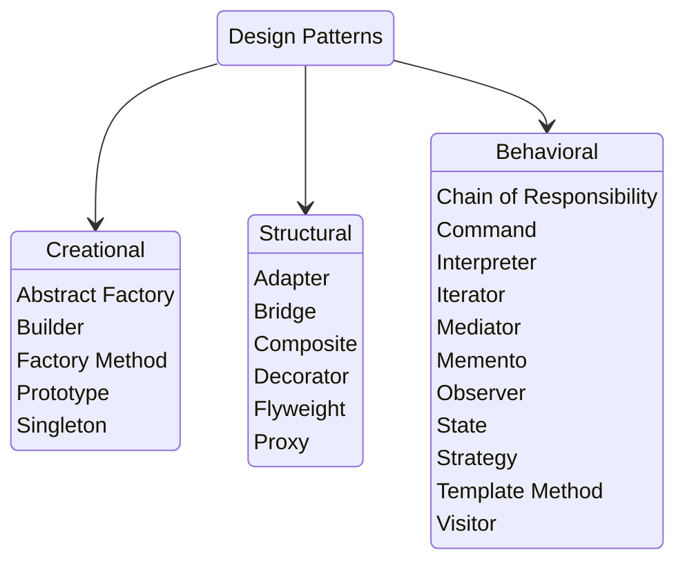

### Design Patterns 🧩

Dastur hajmi oshib borgani sari uni qo'llab-quvvatlash, eski kodga ta'sir qilmasdan yangi funksiyalar qo'shish va eski  funksiyalarni yangi modullarda muammosiz ishlatish murakkablashib boradi. Hech qanday dizayn patternlarga rioya qilinmasa yuqoridagi imkoniyatlar bilan hayrlashishga to'g'ri keladi. `Code Base`ga kichik o'zgarishlar qo'shish ham sistemani juda ko'p qismiga o'zgarish kiritgani uchun barcha o'zgarishlarni tekshirish va testlash imkonsiz bo'lib boradi. 

Dizayn patternlar qo'llab-quvvatlashga, o'zgartirishga va kengaytirishga oson bo'lgan kod yozish imkonini beruvchi qo'liplardir. Dastur ehtiyojida kelib chiqib bir yoki bir-nechta dizayn patternlarni qo'llab uzoq yillar kengayib boradigan `code base` quriladi.

##### Dizayn patternlarni quyadigi asosiy maqsadlari mavjud
- **Kodni tartiblash** - klass/komponentlarni strukturasi va bir-biri bilan munosabatini tartibga soluvchi qoidalar toplamiga ega
- **Qayta ishlatish** - dizayn patternlar qayta ishlatsa bo'ladigan moslashuvchan kod yozishni ta'minlaydi
    - **modulyar dizayn** - module/komponentlarni mustaqil va boshqa komponentlarga bog'liq bo'lmasligini ta'minlaydi
    - **muammolarni yakkalash** - faqatgina bitta muammoga e'tibor qaratadigan klasslar yaratishni ta'minlaydi
    - **umumiy yechimni abstraktsiyalash** - muammolardagi umumiy yechimni/kodni abstraktsiyalash va qayta ishlatishni ta'minlaydi
- **Kengaytirish** - dasturni talablari o'sib borgan sari kelajakda kutiladigan o'zgarishlarga moslashuvchan kod yozish imkonini beradi
- **Kommunikatsiya** - barcha uchun tanish va uzor yillardan beri standardga aylangan dizayn patternlarni ishlatish orqali `code base`ni butunlay o'qib chiqmasdan ham tushinsa bo'ladigan, tashqaridan kelgan odamga *gapirib yuboradigan* kod yozish imkonini beradi

---
Dizayn patternlar asosiy 3 kategoriyaga bo'linadi: 
- **Creational** - obyektlarni yaratish va initsializatsiya qilish jarayonini markazlashtirish, kodni keraksiz qismlariga bog'lanib qolishi(*coupling*)ni oldini olish uchun ishlatiladi
- **Structural** - asosiy vazifasi obyektlarni bir-biri bilan munosabatini qurish va tartiblash. 
- **Behavioral** - ma'lum funksional maqsadga erishish uchun obyektlar bir-biri bilan qanday aloqa qilshi ko'rsatadi

> [!TIP]
> Keyingi postlar dizayn patternlarni har biriga to'xtalib hayotiy misollar bilan tushintirib beraman 🫡