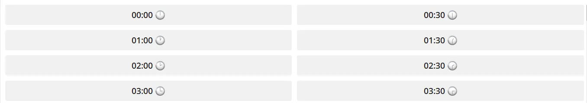

# CRON

CRON - Bu Unix-like (o'zbekcha ma'nosini topa olmadim) operatsion tizimlarda ma’lum bir vaqtda skriptlar yoki komandalarni ishga tushirishni avtomatlashtiruvchi va ishga tushish vaqtini belgilovchi foydali tool hisoblanadi.

```graphql
* * * * * *
| | | | | |
| | | | | +--- Day of the week (0-6) (Sunday=0)
| | | | +----- Month (1-12)
| | | +------- Day of the month (1-31)
| | +--------- Hour (0-23)
| +----------- Minute (0-59)
+------------- Second (0-59) (optional)
```

Bu CRON sintaksisi bo’lib, unda aslida 5 ta bo’lim (*) bor ammo istasangiz 6 chi bo’limga sekundni yozsangiz ham bo’ladi. 

(*) Ushbu belgi “har” (каждый) degan ma’noni anglatadi va agar siz ushbu belgini qaysi bo’limda ishlatsangiz, masalan soat bo’limida, shunda dastur har soatda ishlaydi.

- * * * * *  Bu yerda yulduzchalar 5 ta (sekund yo’q). Demak bu degani dastur har minutda ishlaydi.

---

- * * * * * * Bu yerda bo’lsa yulduzchalar soni 6 ta (sekund ham qo’shilgan). Demak dastur har sekundda ishlaydi.

---

- 0,30 * * * * * Dastur har 0 chi va 30 chi sekundlarda ishlaydi. E’tibor bering qolgan barchasi yulduzcha, demak har daqiqa, soat, kun, oy va hafta kunlarida ishlaydi.

> Masalan ushbu vaqtlarda ishlaydi:
> 
> - 12:00:00
> - 12:00:30
> - 12:01:00
> - 12:01:30
> - va hokazo

---

- 30 * * * * * Bu ifodada esa dastur har daqiqaning aynan 30 chi sekundida ishlaydi.

> Masalan:
> 
> - 12:00:30
> - 12:01:30
> - 12:02:30
> - 12:03:30
> - va hokazo

---

- 0 30 2 * * * Bu yerda esa dastur har kuni soat 02:30 da ishlaydi.

---

- 0 30 2 10 10 5 ifodasi pastda.

> Ifoda:
> 
> - 0 - 0 chi sekund
> - 30 - 30 chi daqiqa
> - 2 - soat 2
> - 10 - oyning 10 chi kuni
> - 10 - yilning 10 chi oyi
> - * - hafta kunining farqi yo’q

Bu yerda dastur shunday qilib har yili 10 chi Oktabrda soat 02:30 da ishga tushadi

- Lekin huddi shu yerda hafta kuniga 2 (ya’ni seshanba) berganimda, aynan 10 chi Oktabr qachonki seshanbaga tushsa dastur usha yildagina ishga tushardi.

---

- 0 9 * * 0 Bu ifodada bo’lsa dastur har yakshanba kuni soat 09:00 da ishga tushadi. (Chunki 0 yakshanbani bildiradi)

---

## CRON so’zining kelib chiqishi

CRON so’zi yunoncha “CHRONAS” so’zidan olingan bo’lib, “vaqt” degan ma’noni anglatadi.

---

## Azure Function Timer Trigger

Azure function ham sizga ushbu servisni taqdim etadi. Masalan [https//:t.me/muazzinuz_bot](https://t.me/MuazzinUz_bot)  va https://t.me/HabitTrackerPlus_bot telegram botlari foydalanuvchilarga eslatmalar yuborishi va holatlarni o’zgartirishi uchun ushbu servisdan foydalanaman. Masalan:

```csharp
public async Task Run([TimerTrigger("0,30 * * * *")] TimerInfo myTimer)
{
    _logger.LogInformation($"C# Timer trigger function executed at: {DateTime.Now}");

    string timeZoneId = "Central Asia Standard Time";
    
    // kod davomi bor
  } 
```

Bu https://t.me/HabitTrackerPlus_bot ning kodidan bir parcha bo’lib, u har yarim soatta ishlaydi chunki ushbu botda foydalanuvchi kunning istalgan yarim soatini tanlashi mumkin.



https://t.me/HabitTrackerPlus_bot botidan misol

---

https://t.me/MuazzinUz_bot da esa dastur har daqiqada ishlaydi. Namoz vaqtini oldindan bilsa bo’lmasligi uchun uni har daqiqada ishlaydigan qilgamman.

- 0 * * * * * bu ifoda har daqiqada ishlasin degani.

---

[!INCLUDE [<author>](../authors/muhammad_khodjaev.html)]
