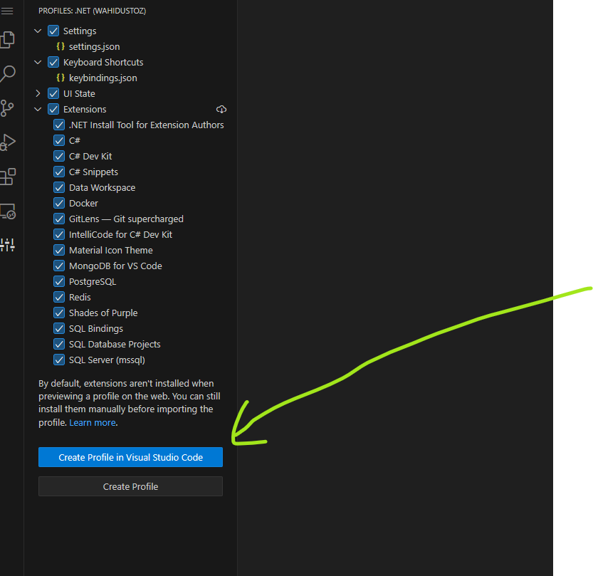

# VS Code setup

VS Code dasturini bilmaydigan dasturchi bo’lmasa kerak. U bugunning eng zamonaviy universal va yengil ishlovchi kod tahrirchisi. U orqali hohlagan SDK va framework’da loyihalar amalga oshirsa bo’ladi. Uning kichik hajmli ekani o’rnatish va ishni boshlash uchun juda qulay. 

Bundan tashqari har bir yo’nalish va tech-stack uchun alohida extension (kengaytma)lar mavjud bo’lib, ular orqali VS Code dasturini tark etmasdan istalgan ishni amalga oshirsa bo’ladi. Shulardan eng muhimlari va aynan .NET dasturchilar uchun zarur bo’lganlari haqida bugun gaplashamiz.

***Vaqtingiz yo’q bo’lsa manabu yerga keling va profilni bittada yuklab oling!*** 👉 [Profilni yuklash](https://www.notion.so/Profilni-yuklash-832ead29433246bb83bb63a37408fdec?pvs=21) 

## Ko’rinish

Chiroyli, estetik va sodda ko’rinishga ega setup qilishga harakat qilaman. Buning uchun quyidagi extension va o’zgarishlar kerak bo’ladi.

- **Material Icon Theme:** [PKief.material-icon-theme](https://marketplace.visualstudio.com/items?itemName=PKief.material-icon-theme)

VS Code har xil fayl turiga qarab turlicha cute ikonkalar ko’rsatadi. 

- **Shades of Purple:**  [ahmadawais.shades-of-purple](https://marketplace.visualstudio.com/items?itemName=ahmadawais.shades-of-purple)

Juda ham sodda va ranglari ajralib turuvchi mavzu. Unda dominant rang to’q ko’k rang. Koddagi sintaks ham yaqqol ajralib ko’zga tashlanib turadi.

---

### Font hajmini boshqarish

Bundan tashqari editor font (tahrirolvchi fonti)ni osonlik bilan kattalashtirish yoki kichiklashtirish uchun maxsus Shortcut (qisqa kod) yaratilgan. Editor Font’ni kattalashtirish uchun `CTRL+SHIFT+=` kichiklashtirish uchun esa `CTRL+SHIFT+-` bossangiz kifoya. Mening ishlash ekranim hajmi katta bo’lgani uchun ekrandan uzoqroqqa o’tib olgan holda fontni kattaroq qilib ishlashni yoqtiraman.

> [!NOTE]
> Shu o’rinda aytib o’tish kerak `CTRL+=` va `CTRL+-` tugmalarini `SHIFT`siz bosadigan bo’lsangiz butun VS Code oynasi fonti haji o’zgaradi.

---

## .NET Essentials

Endi asosiy mavzuga o’tamiz. .NET dasturchilari uchun o’rnatib olishi kerak bo’lgan extension va sozlamalar bilan tanishamiz.

- **C# Dev Kit:** [ms-dotnettools.csdevkit](https://marketplace.visualstudio.com/items?itemName=ms-dotnettools.csdevkit)

Microsoft tomonidan yaqindagina taqdim etilgan ushbu extension C# uchun eng kerakli uskunalarni va qulayliklarni o’z ichiga oladi. Bulardan *intellisense*, *test explorer* va .NET fayllarini sichqoncha orqali qo’shish imkoniyati.

> [!NOTE]
>  Ushbu extension bilan birgalikda ***C# Extension*** va ***IntelliCode for C# Dev Kit*** (AI’ga asoslangan kodni taxmin qilish qurilmasi) qo’shimcha ravishda automatik o’rnatiladi.

- **C# Snippets:** [jorgeserrano.vscode-csharp-snippets](https://marketplace.visualstudio.com/items?itemName=jorgeserrano.vscode-csharp-snippets)

Bu extension orqali C# tilidagi kodlarini yozib o’tirmasdan ularni qisqarmasi orqali automatik kod generate qilsa bo’ladi. Masalan, `class` so’zini yozgandan keyin **`TAB`** tugmasini bossangiz sizga automatik siz turgan fayl nomi bilan bir xil nomga ega klass yaratib beradi.

---

## Injiner uchun kerakli

Quyidagi extensionlar barcha injinerlar uchun juda foydali va ish tezligini oshirishga yordam beradi.

- **Docker:** [ms-azuretools.vscode-docker](https://marketplace.visualstudio.com/items?itemName=ms-azuretools.vscode-docker)

Docker extension orqali sistemadagi docker container va image’larni VS Code’ni tark etmasdan boshqarsa bo’ladi.

- **GitLens — Git supercharged:** [eamodio.gitlens](https://marketplace.visualstudio.com/items?itemName=eamodio.gitlens)

**git** ishlatadigan har qanday injiner Git Lens extension o’rnatib olishi shart. Git bilan bog’liq ma’lumotlar shu bitta extension orqali ko’rinadi.

### Database clients

- **MongoDB for VS Code:** [mongodb.mongodb-vscode](https://marketplace.visualstudio.com/items?itemName=mongodb.mongodb-vscode)

Ushbu extension vscode’ni o’zidan turib MongoDB’ga ulanish va uni boshqarish imkonini beradi.

- **PostgreSQL:** [ms-ossdata.vscode-postgresql](https://marketplace.visualstudio.com/items?itemName=ms-ossdata.vscode-postgresql)

PostgresSQL server uchun eng qulay va yengil ishlovchi klient.

- **SQL Server (mssql):** [ms-mssql.mssql](https://marketplace.visualstudio.com/items?itemName=ms-mssql.mssql)

MSSQL foydalanuvchilari uchun esa quyidagi extension eng foydali bo’ladi.

- **Redis:** [cweijan.vscode-redis-client](https://marketplace.visualstudio.com/items?itemName=cweijan.vscode-redis-client)

Local redis klient, redis instance’lar va cache boshqaruvi uchun ajoyib extension.

# Profilni yuklash

> [!NOTE]
> Yuqoridagi hammasini hech qanday muammosiz bitta tugma bosish orqali o’rnatib olish uchun quyidagi men ishlatadigan Profil’ni VS Code dasturiga yuklang!

1. Quyidagi linkni oching: [.NET (wahidustoz)](https://vscode.dev/profile/github/75e28ac17ce45bc100d79d0e3c630c85)
2. Rasmda ko’rsatilgan tugmani bosib yangi profil yarating va zavqlaning

---

[!INCLUDE [<author>](../authors/wahid_abduhakimov.html)]